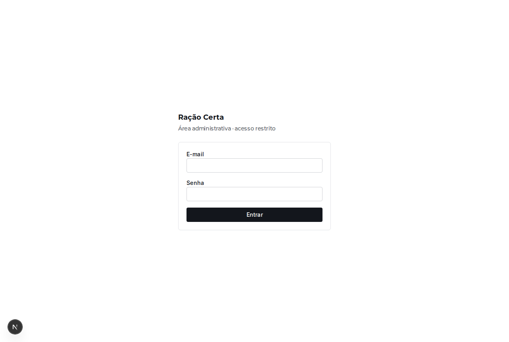
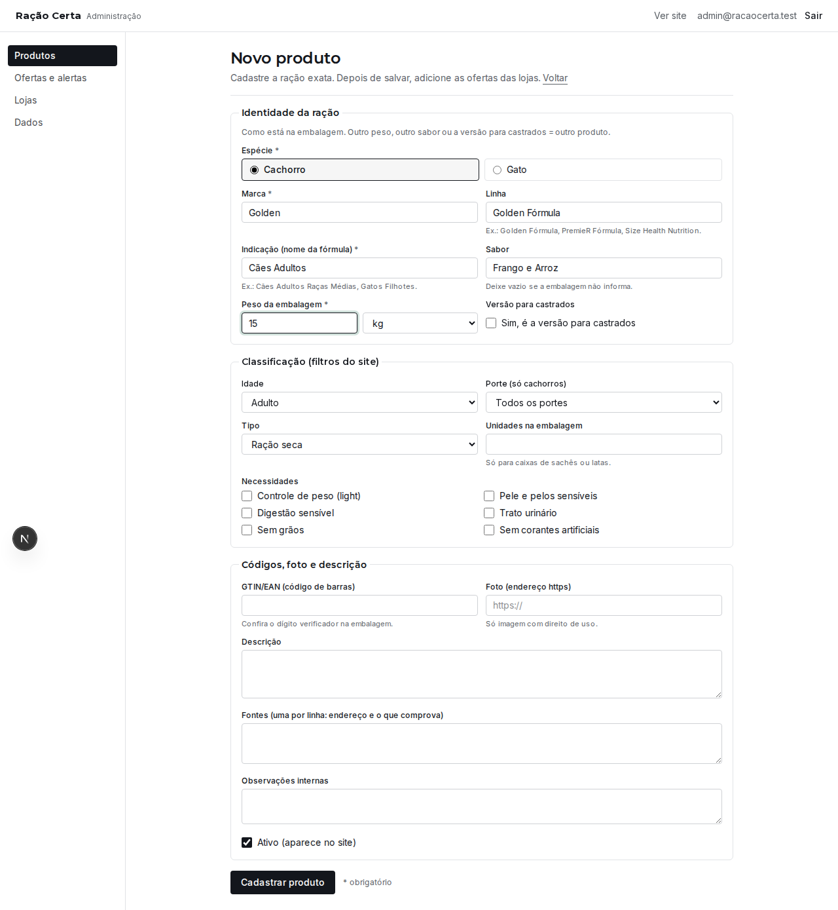
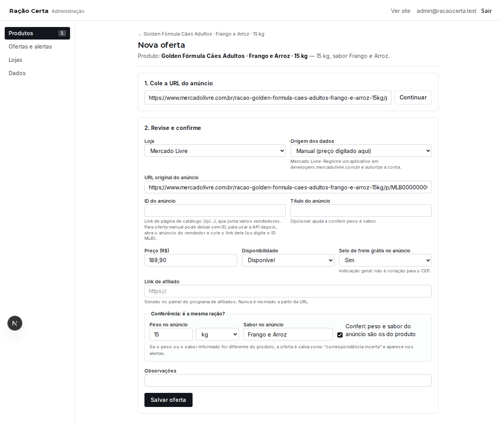
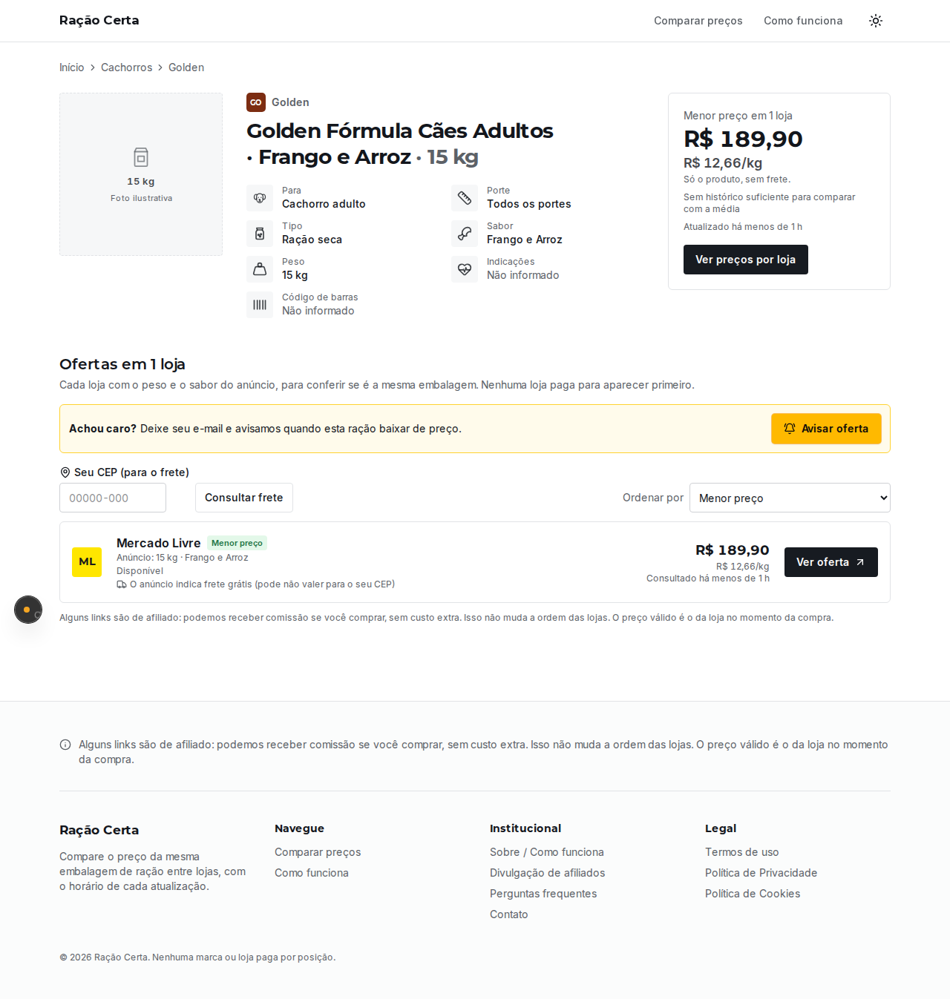

# Passo a passo: zerar os dados e cadastrar 3 rações do Mercado Livre

Guia para quem nunca mexeu com programação. Leva uns 30 a 40 minutos na primeira vez.
Você vai: instalar um programa, baixar o site, criar sua senha do painel, apagar os dados de exemplo
e cadastrar 3 rações com o preço e o link do Mercado Livre.

> **Palavras que aparecem aqui**
> - **Terminal**: uma janela onde você digita comandos. Não precisa entender o comando, só copiar, colar e apertar **Enter**.
> - **Painel**: a área de administração do site, em `/admin`, protegida por senha.
> - **Produto**: a ração exata (marca, linha, indicação, sabor e peso). **Oferta**: o anúncio dessa ração numa loja, com o preço.

---

## Parte 1 — Preparar o computador (só na primeira vez)

### 1. Instale o Node.js

1. Abra o site **nodejs.org**.
2. Clique no botão da versão **LTS** (a recomendada).
3. Abra o arquivo baixado e clique em **Avançar / Next** até terminar. Não precisa mudar nenhuma opção.

### 2. Abra o terminal

- **Windows**: aperte a tecla **Windows**, digite **cmd** e abra o **Prompt de Comando**.
  (Evite o PowerShell: ele pode bloquear o `npm` com a mensagem “a execução de scripts foi desabilitada”.)
- **Mac**: aperte **Cmd + Espaço**, digite **Terminal** e abra.

Para conferir se o Node.js foi instalado, digite o comando abaixo e aperte **Enter**:

```
node -v
```

Deve aparecer algo como `v22.…`. Se aparecer “não é reconhecido” ou “command not found”, feche o terminal,
abra de novo e tente outra vez (se continuar, reinstale o Node.js).

### 3. Baixe o site (versão certa)

1. Baixe o arquivo ZIP por este link direto (já é a versão certa):
   **https://github.com/andrecemba/app-viagem/archive/refs/heads/claude/bold-turing-6vq203.zip**
2. Crie uma pasta **fora do OneDrive**, por exemplo **C:\Projetos**.
   O OneDrive fica sincronizando os milhares de arquivos que o site instala e pode travar a instalação ou o banco de dados.
3. Descompacte o ZIP nessa pasta (botão direito → **Extrair tudo**).
4. Confira se é a versão certa: dentro da pasta extraída tem que existir as pastas **db**, **docs** e **scripts**,
   além de **src** e **tests**. Se não tiver essas três, você baixou uma versão antiga: apague e baixe pelo link acima.

> O ZIP cria uma pasta com nome comprido, como `app-viagem-claude-bold-turing-6vq203`. A pasta certa é a que tem o arquivo **package.json**.

### 4. Entre na pasta do site pelo terminal

No terminal, digite `cd` e um **espaço**, depois **arraste a pasta do site** (a que tem o arquivo `package.json`)
para dentro da janela do terminal. O caminho aparece sozinho. Aperte **Enter**.

```
cd /d "C:\Projetos\app-viagem-claude-bold-turing-6vq203"
```

(No Prompt de Comando do Windows, o `/d` permite trocar de disco e as aspas aceitam espaços no nome.)

(O seu caminho vai ser diferente. Tudo bem.)

### 5. Instale as peças do site

```
npm install
```

Demora alguns minutos e mostra muitas linhas. Espere voltar a aparecer o cursor piscando.
Avisos em amarelo (“warn”) são normais.

### 6. Crie o seu acesso ao painel

```
npm run configurar
```

O programa pergunta:
1. **E-mail** para entrar no painel.
2. **Senha** (mínimo 12 caracteres). Enquanto você digita, aparecem só asteriscos — é assim mesmo.
3. A mesma senha de novo.

No fim aparece **“Pronto! Configuração salva”**. Guarde a senha: ela não fica escrita em lugar nenhum.

---

## Parte 2 — Zerar os dados

O site vem com rações e preços **de exemplo** para demonstração. Para começar do zero:

```
npm run db:zerar
```

O programa explica o que vai apagar e pede confirmação. Digite **ZERAR** (em maiúsculas) e aperte **Enter**.

- **É apagado:** todos os produtos, ofertas, históricos, pedidos de “Avisar oferta” e acessos registrados.
- **Continua:** as 6 lojas (Mercado Livre, Shopee, Amazon, Petz, Cobasi, Petlove) e as configurações.
- **Não dá para desfazer.** Se quiser guardar uma cópia antes, copie o arquivo `.data/racao.db` da pasta do site para outro lugar.

> Se digitar qualquer outra coisa, nada é apagado.

---

## Parte 3 — Abrir o site e o painel

```
npm run dev
```

Quando aparecer **“Ready”**, **deixe essa janela do terminal aberta** (se fechar, o site sai do ar).
Abra o navegador e acesse:

- Site: **http://localhost:3000** — agora deve dizer “Ainda não há rações no comparador”.
- Painel: **http://localhost:3000/admin** — entre com o e-mail e a senha do passo 6.



---

## Parte 4 — Separar as 3 rações no Mercado Livre

Faça isto para cada uma das 3 rações. Vale anotar num papel ou bloco de notas.

1. No Mercado Livre, abra o anúncio da ração.
2. **Copie o link** da barra de endereço do navegador (clique na barra, **Ctrl+C** no Windows ou **Cmd+C** no Mac).
3. Anote, olhando o **título** e a parte **“Características do produto”** do anúncio:

| Anote | Exemplo | Onde achar no anúncio |
|---|---|---|
| Espécie | Cachorro | título |
| Marca | Golden | título ou “Marca” |
| Linha | Golden Fórmula | título ou “Linha” |
| Indicação | Cães Adultos | título (para quem é: adulto, filhote, raça pequena, castrado…) |
| Sabor | Frango e Arroz | título ou “Sabor” |
| Peso | 15 kg | título ou “Peso” |
| Preço | 189,90 | preço grande do anúncio (**sem** somar frete) |
| Frete grátis? | Sim / Não | aparece “Frete grátis” perto do preço? |

> **Atenção à embalagem:** 3 kg e 15 kg são **produtos diferentes**. Sabor diferente ou versão “castrados” também.
> Se o anúncio vende vários pesos (tem botões para escolher o tamanho), escolha o peso antes de anotar o preço e copiar o link.

**Link de afiliado (opcional):** se você participa do programa de afiliados do Mercado Livre, use a barra de afiliados
que aparece no topo do anúncio para **gerar o link** (costuma começar com `https://mercadolivre.com/sec/` ou `https://meli.la/`).
Copie esse link também. Sem ele a oferta funciona, só não gera comissão.

---

## Parte 5 — Cadastrar cada ração no painel

### 5.1 Cadastre o produto

1. No painel, clique em **Produtos** → **Novo produto**.
2. Preencha com o que você anotou:
   - **Espécie**: Cachorro ou Gato.
   - **Marca**, **Linha**, **Indicação**, **Sabor**.
   - **Peso da embalagem**: só o número (ex.: `15`) e escolha **kg** ou **g** ao lado. Use vírgula para decimais: `10,1`.
   - **Versão para castrados**: marque só se o nome da ração disser “castrados”.
   - **Idade** e **Porte** ajudam nos filtros do site (se não souber, deixe “Não informado”).
3. Clique em **Cadastrar produto**.



Se aparecer **“Já existe um produto com a mesma…”**, essa ração já está cadastrada: volte em **Produtos**,
abra a que já existe e vá para o passo 5.2.

### 5.2 Adicione a oferta do Mercado Livre

1. Na página do produto que acabou de salvar, clique em **Nova oferta** (botão no lado direito).
2. **Cole o link do anúncio** no campo e clique em **Continuar**.
3. Confira o que o sistema preencheu sozinho:
   - **Loja**: deve aparecer **Mercado Livre**.
   - **ID do anúncio**: pode ficar vazio. Links de catálogo (com `/p/` no endereço) não trazem o ID, e para cadastro manual tudo bem.
4. Preencha:
   - **Preço (R$)**: ex.: `189,90`.
   - **Disponibilidade**: Disponível.
   - **Selo de frete grátis no anúncio**: Sim, Não ou Não informado.
   - **Link de afiliado**: cole o link gerado no programa de afiliados (ou deixe vazio).
5. Na caixa **“Conferência: é a mesma ração?”**:
   - Escreva o **peso** e o **sabor** como estão no anúncio.
   - Marque **“Conferi: peso e sabor do anúncio são os do produto”**.
6. Clique em **Salvar oferta**.



Se o peso ou o sabor do anúncio for diferente do produto, a oferta é salva com o aviso **“correspondência incerta”**
e aparece em **Ofertas e alertas**. Confira se colou o link certo.

### 5.3 Repita para as outras 2 rações

Volte ao passo 5.1 para a segunda e a terceira ração.

---

## Parte 6 — Conferir no site

Abra **http://localhost:3000**. As 3 rações aparecem com o preço, o preço por kg e “Atualizado há …”.
Clique numa delas para ver a página com a oferta do Mercado Livre e o botão **Ver oferta**
(que leva ao link de afiliado, ou ao link do anúncio se não houver afiliado).



**É normal ver:**
- **“Sem histórico suficiente para comparar com a média”**: a comparação com a média precisa de pelo menos 7 dias de preços.
- **“Top descontos do dia”** não aparece ainda, pelo mesmo motivo.
- **“Frete: informe o CEP ou confira na loja”**: o frete por CEP só é calculado quando a integração automática do Mercado Livre estiver ligada.

---

## Parte 7 — Manter o preço atualizado

Depois de **48 horas**, o site marca o preço como **desatualizado** (em amarelo). Para atualizar à mão:

1. No painel, abra **Ofertas e alertas** (ou o produto) e clique na oferta.
2. Troque o **Preço** e clique em **Salvar**. O preço antigo fica guardado no histórico.

Para o preço atualizar sozinho, ligue a API oficial do Mercado Livre (Parte 8).

---

## Parte 8 — Ligar e testar a API do Mercado Livre (opcional)

Com a API ligada, o painel busca preço, disponibilidade, frete grátis, peso e sabor direto do Mercado Livre,
e o botão **Atualizar agora pela API** (na oferta) passa a funcionar. Sem ela, tudo continua funcionando no modo manual.

### 8.1 Crie o aplicativo (uma vez só)

1. Acesse **https://developers.mercadolivre.com.br** e entre com a **mesma conta** do Mercado Livre.
2. Procure **Minhas aplicações** → **Criar uma aplicação** (os nomes podem mudar um pouco).
3. Preencha:
   - **Nome** e **descrição**: qualquer um, ex.: “Comparador de ração”.
   - **URI de redirect**: `https://www.google.com.br/` (exatamente assim, com a barra no fim).
   - **Escopos / permissões**: marque **leitura** (read) e **acesso offline** (offline_access). Sem o offline, a conexão cai em poucas horas.
   - Se houver a opção **PKCE**, deixe **desligada**.
   - Tópicos de notificação e URL de notificações: pode deixar em branco.
4. Salve. Na tela do aplicativo aparecem o **ID do aplicativo** (Client ID, só números) e a **Chave secreta** (Client Secret).
   **Não mande a chave secreta para ninguém**, nem em print.

### 8.2 Conecte o site ao aplicativo

Com o site desligado (Ctrl+C), na janela do terminal da pasta do site:

```
npm run ml:conectar
```

1. Cole o **Client ID** e aperte Enter.
2. Cole a **Chave secreta** e aperte Enter.
3. No redirect, só aperte **Enter** (usa `https://www.google.com.br/`).
4. O programa mostra um link. Copie, abra no navegador, entre na conta e clique em **Permitir**.
5. O navegador vai para o Google. **Copie o endereço inteiro** da barra (tem `?code=TG-…`), volte ao terminal, cole e aperte Enter.
   O código vale só alguns minutos: se demorar, rode `npm run ml:conectar` de novo.

Aparece **“Pronto! Mercado Livre conectado”**. As chaves ficam só no arquivo `.env.local` do seu computador.

### 8.3 Teste a API com um anúncio

```
npm run ml:testar -- COLE_O_LINK_DO_ANUNCIO 01310100
```

(O número no fim é um CEP, para testar o frete. Pode tirar.)

Se estiver tudo certo, aparecem título, preço, disponibilidade, frete grátis, peso e sabor do anúncio,
e a frase **“A API está funcionando”**.

| O que aparece | O que fazer |
|---|---|
| “Mercado Livre não conectado” | Rode `npm run ml:conectar` (8.2). |
| “Link de página de catálogo (/p/…)” | Na página, clique no vendedor (“Outras opções de compra” ou o nome da loja), abra o anúncio dele e use esse link. |
| “recusou o acesso (HTTP 401/403)” | Rode `npm run ml:conectar` de novo. Se continuar, o Mercado Livre pode não liberar anúncios de outros vendedores para o seu aplicativo: cadastre essa oferta pelo modo manual (Parte 5). |
| “O Mercado Livre não devolveu o refresh token” | No aplicativo, marque **offline_access**, salve e conecte de novo. |

### 8.4 Cadastrar usando a API

1. Rode `npm run dev` de novo.
2. Cadastre o produto (5.1). Em **Nova oferta**, cole o link do anúncio e clique em **Continuar**.
3. Clique em **Buscar dados do anúncio pela API**: preço, disponibilidade, frete grátis, peso e sabor vêm preenchidos. **Confira** com o produto e salve.
4. Daí em diante, **Atualizar agora pela API** (na oferta) e a atualização programada renovam o preço sozinhos.
   O link de afiliado continua sendo colado por você: ele não vem da API.

### 8.5 Ofertas que você já cadastrou à mão (ou por planilha sem API)

Elas continuam manuais até você ligar a atualização automática:

- **Uma oferta:** abra a oferta (**Ofertas e alertas** → clique nela) e clique em **Atualizar automaticamente pela API**.
  Na hora, preço, disponibilidade e frete grátis são trocados pelos do anúncio oficial. O link de afiliado continua o seu.
- **Todas de uma vez:** em **Lojas**, no Mercado Livre, clique em **Atualizar N oferta(s) manual(is) pela API**.
- Para voltar a controlar à mão: na oferta, **Voltar para cadastro manual** (os valores atuais ficam).

Os botões ficam cinza enquanto a API não estiver conectada (8.2) ou se a oferta não tiver o ID do anúncio (MLB…).

**Atualizar os preços depois:** em **Lojas → Atualizar agora** (Mercado Livre), ou no terminal `npm run precos:atualizar`.
Só são consultadas as ofertas com mais de ~43 horas desde a última consulta (marque “incluir as não vencidas” para todas).

---

## Parte 9 — Importar várias rações por planilha

Em vez de cadastrar uma a uma, dá para montar uma planilha e importar tudo de uma vez.

1. No painel, **Produtos → Importar planilha → Baixar o modelo (.csv)**. Abra no Excel ou no Google Planilhas.
2. Uma linha por ração + anúncio. Colunas:

| Coluna | O que colocar | Exemplo |
|---|---|---|
| especie | Cachorro ou Gato | Cachorro |
| marca, linha, indicacao | como no anúncio | Fórmula Natural · Fresh Meat · Filhotes Mini e Pequeno |
| sabor | como no anúncio | Frango |
| peso | peso da embalagem, com kg ou g | 2,5 kg |
| castrado | sim ou não | não |
| idade | filhote, adulto, sênior ou todas | filhote |
| porte | mini, pequeno, médio, grande, mini e pequeno, médio e grande, todos | mini e pequeno |
| tipo | seca, natural, úmida ou medicamentosa | seca |
| link_anuncio | link do anúncio (barra do navegador) | https://www.mercadolivre.com.br/… |
| id_anuncio | pode deixar vazio: sai do link quando dá | MLB7125580428 |
| preco, disponivel, frete_gratis | preço sem frete; sim/não | 149,90 · sim · sim |
| link_afiliado | link gerado no programa de afiliados | https://meli.la/… |
| observacao | anotação sua (opcional) | |

3. **Não preencha nada que não conferiu no anúncio.** O que ficar vazio aparece como **“Pendente de verificação”**.
   Sem **espécie, marca, indicação, peso e link do anúncio** a linha não é importada (para não criar a ração errada).
4. Envie a planilha do jeito que ela está: **.xlsx** serve (Excel: *Salvar*; Google Planilhas: *Arquivo → Fazer download → Microsoft Excel (.xlsx)*).
   CSV também serve. Só a **primeira aba** é lida. Em **Importar planilha**, escolha o arquivo e clique em **Importar**.
   Cada anúncio vale para uma ração só: repetir o mesmo link em outra linha não cria nada.
5. O resultado mostra cada linha: **Importado**, **Pendente de verificação** (com o que falta), **Já cadastrado** ou **Erro**.
   Pode importar o mesmo arquivo de novo depois de completar: o que já existe não é duplicado.

**Preenchimento automático:** com a API do Mercado Livre ligada (Parte 8), basta **link_anuncio** e o básico da ração.
Preço, disponibilidade, frete grátis, peso, sabor e foto vêm do anúncio oficial (se o peso ficar vazio, usa o do anúncio).

---

## Problemas comuns

| O que aparece | O que fazer |
|---|---|
| `npm` ou `node` “não é reconhecido” | Feche e abra o terminal. Se continuar, reinstale o Node.js (Parte 1). |
| “Missing script: configurar” ou “db:zerar” | A pasta é de uma versão antiga. Baixe de novo pelo link do passo 3 e confira as pastas **db**, **docs** e **scripts**. |
| “a execução de scripts foi desabilitada neste sistema” | Você está no PowerShell. Use o **Prompt de Comando** (cmd). |
| Erros de “EPERM” ou “arquivo em uso” no `npm install` | A pasta está no OneDrive. Mova para `C:\Projetos` e rode `npm install` de novo. |
| “A URL não é de Mercado Livre” | O link precisa ser do anúncio (`mercadolivre.com.br`). Links curtos de compartilhamento (`meli.la`) vão no campo **Link de afiliado**, não no da URL. |
| “O link de afiliado não é de Mercado Livre…” | Confira se colou o link de afiliado do Mercado Livre, e não de outra loja. |
| “Já existe um produto com a mesma espécie, marca…” | A ração já está cadastrada. Abra a existente e adicione a oferta nela. |
| Depois de zerar, o site e o painel ainda mostram “Exemplo” / “Demonstração” | Versão antiga do site (antes de 28/09). Feche o site (Ctrl+C), baixe o ZIP de novo (passo 3), copie o arquivo `.env.local` da pasta antiga para a nova, rode `npm install`, `npm run db:zerar` e `npm run dev`. |
| Não aparece o botão **Importar planilha** em Produtos | Versão antiga do site. Baixe o ZIP de novo (passo 3), copie o `.env.local` e a pasta `.data` da pasta antiga para a nova e rode `npm install`. |
| O site não abre em localhost:3000 | Veja se a janela do `npm run dev` ainda está aberta. Se fechou, rode `npm run dev` de novo. |
| “Port 3000 is in use” | Já tem um site aberto em outra janela. Feche-a ou use o endereço que o terminal mostrar. |
| Esqueci a senha do painel | Rode `npm run configurar` de novo e crie outra. |
| Quero os dados de exemplo de volta | `npm run db:reset` (apaga tudo e recria com os exemplos). |

Para desligar o site: clique na janela do terminal e aperte **Ctrl+C**.
Para ligar de novo outro dia: abra o terminal, entre na pasta (passo 4) e rode `npm run dev`.
